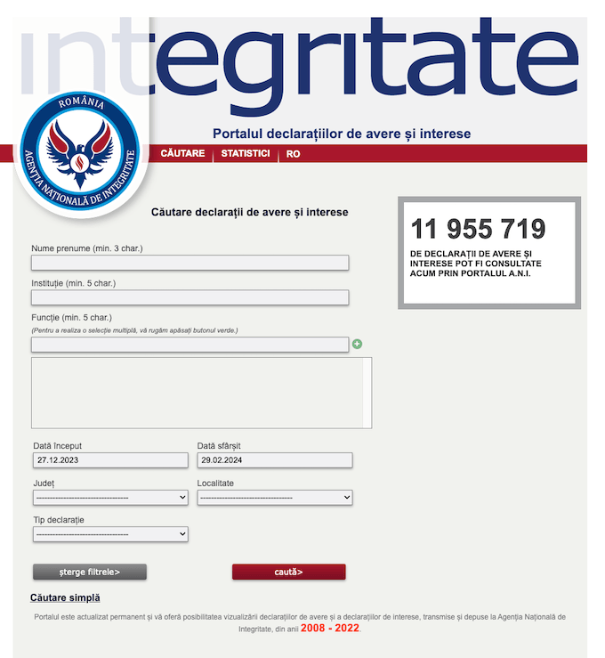
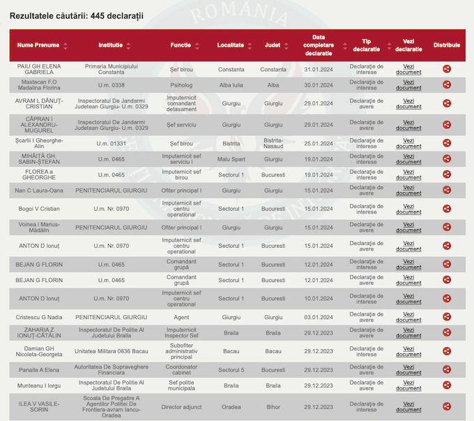

[declaratii.integritate.eu](https://declaratii.integritate.eu/) 

- `declaratii-integritate.py `- fetches html rows and csvs (Exporta resultate)
- `consolidate_dl_csvs.py` - consolidates dowloaded (Exporta resultate) csvs
- `consolidate-all.py` - consolidates Exported csv w parsed html rows

## Roadmap

big pages wo pagination?
count page turns
max 10k
go for bucuresti, bucuresti si un fel de declaratie
then difference per judet, log errors

- [x] get data from result table
- [x] follow pagination
- [x] loop dates
- [x] log errors
- [ ] log results & meta/ count results
- [x] prevent overwrite (update untill found)
- [ ] scrape from today to the latest logged day
- [ ] split into functions
- [ ] update missing values
    - [ ] break query in parts - date, tip declaratie, judet
- [x] download csvs
  - [ ] rename to target date

- [ ] consolidate declaratii din tabel
- [x] consolidate downloaded csvs
    - [x] remove duplicates
- [x] compare results - between downloaded csvs and scraped table pages / rows 
- [ ] download pdfs
- [ ] parse pdfs

----

### Initial approach

open page
click advanced

    loop (while start_date < earliest_date)
        add dates 
        see if max 10000 - if so previou day log err
        see if none - if so previous range log err

        if resultsTable

        read table (function)
        check if next
            append table
            advance next

        write to csv
        advance days

1 - open https://declaratii.integritate.eu/index.html

2 - click 'Căutare avansată' button (<a id="form:showAdvancedSearch">) found here: 
<a href="#" id="form:showAdvancedSearch">Căutare avansată</a>

3 - wait for 
<table><tbody><tr><td>
 to load

4 - input current date (ex: 03.10.2023) in this field, also change 'value' parameter accordingly  <input id="form:endDate_input" name="form:endDate_input" role="textbox" type="text" value="03.10.2023">
    input current date - 3 working days (ex: 29.09.2023) in  <input id="form:startDate_input" name="form:startDate_input" role="textbox" size="10" type="text" value="29.09.2023"> - also change 'value' attribute inside tag

5 - click on <input id="form:submitButtonAS"> inside 
<input class="button" id="form:submitButtonAS" name="form:submitButtonAS" type="submit" value="caută>">

----

<table><thead id="form:resultsTable_header"><tr><th class="ui-widget-header ui-col-0">
Nume Prenume&nbsp;
</th><th class="ui-widget-header ui-col-1">
Institutie&nbsp;
</th><th class="ui-widget-header ui-col-2">
Functie&nbsp;
</th><th class="ui-widget-header ui-col-3">
Localitate&nbsp;
</th><th class="ui-widget-header ui-col-4">
Judet&nbsp;
</th><th class="ui-widget-header ui-col-5">
Data completare declaratie&nbsp;
</th><th class="ui-widget-header ui-col-6">
Tip declaratie&nbsp;
</th><th class="ui-widget-header ui-col-7">
Vezi declaratie
</th><th class="ui-widget-header ui-col-8">
Distribuie
</th></tr></thead><tbody class="ui-datatable-data ui-widget-content" id="form:resultsTable_body"><tr class=" ui-datatable-odd  " id="form:resultsTable_row_25" tabindex="0"><td class="null ui-col-0">GRECU P PETRUȚA AURORA</td><td class="null ui-col-1">Liceul Tehnologic Energetic Dragomir Hurmuzescu Deva</td><td class="null ui-col-2">Director adjunct</td><td class="null ui-col-3">Deva</td><td class="null ui-col-4">Hunedoara</td><td class="null ui-col-5">30.09.2023</td><td class="null ui-col-6">Declaraţie de avere</td><td class="null ui-col-7">
<a href="/DownloadServlet?fileName=15080778_2787787_a.pdf&amp;uniqueIdentifier=NTNTARTLNE_15080778" target="_self">Vezi document</a></td><td class="null ui-col-8"><input alt="Distribuie" class="shareButton" id="form:resultsTable:25:shareBtn" name="form:resultsTable:25:shareBtn" onclick="ice.ace.ab({'source':'form:resultsTable:25:shareBtn','execute':'form:resultsTable:25:shareBtn','render':'shareDialog','event':'action'});;return false" type="submit" value="" data-hasqtip="form:resultsTable:25:_t154"></td></tr><tr class=" ui-datatable-even  " id="form:resultsTable_row_26" tabindex="0"><td class="null ui-col-0">DAMIAN D IULIA</td><td class="null ui-col-1">Administratia Nationala Apele Romane - Cod Caen 3600, 3900, 4291, 6203, 7112, 7120, 7219, 8413, 8425, 8559</td><td class="null ui-col-2">Șef birou</td><td class="null ui-col-3">Sectorul 1</td><td class="null ui-col-4">Bucuresti</td><td class="null ui-col-5">02.10.2023</td><td class="null ui-col-6">Declaraţie de avere</td><td class="null ui-col-7">
<a href="/DownloadServlet?fileName=15070872_2787968_a.pdf&amp;uniqueIdentifier=NTNTARTLNE_15070872" target="_self">Vezi document</a></td><td class="null ui-col-8"><input alt="Distribuie" class="shareButton" id="form:resultsTable:26:shareBtn" name="form:resultsTable:26:shareBtn" onclick="ice.ace.ab({'source':'form:resultsTable:26:shareBtn','execute':'form:resultsTable:26:shareBtn','render':'shareDialog','event':'action'});;return false" type="submit" value="" data-hasqtip="form:resultsTable:26:_t154"></td></tr><tr class=" ui-datatable-even  " id="form:resultsTable_row_48" tabindex="0"><td class="null ui-col-0">TEODORESCU Gh GEORGETA</td><td class="null ui-col-1">Inspectoratul Scolar Al Judetului Arges</td><td class="null ui-col-2">Inspector scolar</td><td class="null ui-col-3">Pitesti</td><td class="null ui-col-4">Arges</td><td class="null ui-col-5">30.09.2023</td><td class="null ui-col-6">Declaraţie de interese</td><td class="null ui-col-7">
<a href="/DownloadServlet?fileName=15080747_2787683_a.pdf&amp;uniqueIdentifier=NTNTARTLNE_15080747" target="_self">Vezi document</a></td><td class="null ui-col-8"><input alt="Distribuie" class="shareButton" id="form:resultsTable:48:shareBtn" name="form:resultsTable:48:shareBtn" onclick="ice.ace.ab({'source':'form:resultsTable:48:shareBtn','execute':'form:resultsTable:48:shareBtn','render':'shareDialog','event':'action'});;return false" type="submit" value="" data-hasqtip="form:resultsTable:48:_t154"></td></tr><tr class=" ui-datatable-odd  " id="form:resultsTable_row_49" tabindex="0"><td class="null ui-col-0">Gorcitz V Lucica</td><td class="null ui-col-1">Directia Generala Regionala A Finantelor Publice Brasov</td><td class="null ui-col-2">Inspector</td><td class="null ui-col-3">Targu Mures</td><td class="null ui-col-4">Mures</td><td class="null ui-col-5">02.10.2023</td><td class="null ui-col-6">Declaraţie de avere</td><td class="null ui-col-7">
<a href="/DownloadServlet?fileName=15080746_2787919_a.pdf&amp;uniqueIdentifier=NTNTARTLNE_15080746" target="_self">Vezi document</a></td><td class="null ui-col-8"><input alt="Distribuie" class="shareButton" id="form:resultsTable:49:shareBtn" name="form:resultsTable:49:shareBtn" onclick="ice.ace.ab({'source':'form:resultsTable:49:shareBtn','execute':'form:resultsTable:49:shareBtn','render':'shareDialog','event':'action'});;return false" type="submit" value="" data-hasqtip="form:resultsTable:49:_t154"></td></tr></tbody></table>

<a href="#" id="form:resultsTable_paginatorbottom_firstPageLink" class="ui-paginator-first ui-state-default ui-corner-all" onclick="ice.setFocus('form:resultsTable_paginatorbottom_firstPageLink');" onkeydown="var e = event || window.event; if (e.keyCode == 32 || e.keyCode == 13) { this.click();return false; }" tabindex="0" title="First" aria-label="First" style="vertical-align:middle;"></a> <a href="#" id="form:resultsTable_paginatorbottom_previousPageLink" class="ui-paginator-previous ui-state-default ui-corner-all" onclick="ice.setFocus('form:resultsTable_paginatorbottom_previousPageLink');" onkeydown="var e = event || window.event; if (e.keyCode == 32 || e.keyCode == 13) { this.click();return false; }" tabindex="0" title="Prev" aria-label="Prev" style="vertical-align:middle;"></a> <a href="#" class="ui-paginator-page ui-state-default ui-corner-all" onclick="ice.setFocus('form:resultsTable_paginatorbottom_current_page');" onkeydown="var e = event || window.event; if (e.keyCode == 32 || e.keyCode == 13) { this.click();return false; }" tabindex="0">1</a><a href="#" onclick="this.focus();" class="ui-paginator-page ui-state-default ui-corner-all ui-paginator-current-page ui-state-active" style="cursor: default;" id="form:resultsTable_paginatorbottom_current_page" onkeydown="var e = event || window.event; if (e.keyCode == 32 || e.keyCode == 13) { this.click();return false; }" tabindex="0">2</a><a href="#" class="ui-paginator-page ui-state-default ui-corner-all" onclick="ice.setFocus('form:resultsTable_paginatorbottom_current_page');" onkeydown="var e = event || window.event; if (e.keyCode == 32 || e.keyCode == 13) { this.click();return false; }" tabindex="0">3</a><a href="#" class="ui-paginator-page ui-state-default ui-corner-all" onclick="ice.setFocus('form:resultsTable_paginatorbottom_current_page');" onkeydown="var e = event || window.event; if (e.keyCode == 32 || e.keyCode == 13) { this.click();return false; }" tabindex="0">4</a> <a href="#" id="form:resultsTable_paginatorbottom_nextPageLink" class="ui-paginator-next ui-state-default ui-corner-all" onclick="ice.setFocus('form:resultsTable_paginatorbottom_nextPageLink');" onkeydown="var e = event || window.event; if (e.keyCode == 32 || e.keyCode == 13) { this.click();return false; }" tabindex="0" title="Next" aria-label="Next" style="vertical-align:middle;"></a> <a href="#" id="form:resultsTable_paginatorbottom_lastPageLink" class="ui-paginator-last ui-state-default ui-corner-all" onclick="ice.setFocus('form:resultsTable_paginatorbottom_lastPageLink');" onkeydown="var e = event || window.event; if (e.keyCode == 32 || e.keyCode == 13) { this.click();return false; }" tabindex="0" title="Last" aria-label="Last" style="vertical-align:middle;"></a>
false null [0, 1, 2, 3, 4, 5, 6, 7, 8]

-----

## SQL

#### Consolidate CSVs (downloaded and scraped from table)

    SELECT
        COALESCE(d.NumePrenume, t.NumePrenume) AS NumePrenume,
        COALESCE(d.Institutie, t.Institutie) AS Institutie,
        COALESCE(d.Datacompletaredeclaratie, t.Datacompletaredeclaratie) AS Datacompletaredeclaratie,
        COALESCE(d.Tipdeclaratie, t.Tipdeclaratie) AS Tipdeclaratie,
        d.Functie_x,
        d.Localitate_x,
        d.Judet_x,
        d.Functie_y,
        d.Localitate_y,
        d.Judet_y,
        d.Vezideclaratie AS Vezideclaratie_d,
        d."Vezideclaratie.1" AS Vezideclaratie1_d,
        t.Functie AS Functie_t,
        t.Localitate AS Localitate_t,
        t.Judet AS Judet_t,
        t.Vezideclaratie AS Vezideclaratie_t,
        t."Vezideclaratie2" AS Vezideclaratie2_t,
        COALESCE(d.page, t.page) AS page,
        COALESCE(d.rezultate, t.rezultate) AS rezultate,
        COALESCE(d.start_date, t.start_date) AS start_date,
        COALESCE(d.end_date, t.end_date) AS end_date,
        CASE 
            WHEN d.NumePrenume IS NOT NULL AND t.NumePrenume IS NOT NULL THEN 'both'
            WHEN d.NumePrenume IS NOT NULL THEN 'dlcsv'
            ELSE 'tblz'
        END AS merged_status
    FROM dlcsv d
    LEFT JOIN tblz t ON d.NumePrenume = t.NumePrenume
                    AND d.Institutie = t.Institutie
                    AND d.Datacompletaredeclaratie = t.Datacompletaredeclaratie
    UNION ALL
    SELECT
        COALESCE(t.NumePrenume, d.NumePrenume),
        COALESCE(t.Institutie, d.Institutie),
        COALESCE(t.Datacompletaredeclaratie, d.Datacompletaredeclaratie),
        COALESCE(t.Tipdeclaratie, d.Tipdeclaratie),
        d.Functie_x,
        d.Localitate_x,
        d.Judet_x,
        d.Functie_y,
        d.Localitate_y,
        d.Judet_y,
        d.Vezideclaratie,
        d."Vezideclaratie.1",
        t.Functie,
        t.Localitate,
        t.Judet,
        t.Vezideclaratie,
        t."Vezideclaratie2",
        COALESCE(t.page, d.page),
        COALESCE(t.rezultate, d.rezultate),
        COALESCE(t.start_date, d.start_date),
        COALESCE(t.end_date, d.end_date),
        CASE 
            WHEN t.NumePrenume IS NOT NULL AND d.NumePrenume IS NULL THEN 'tblz'
            ELSE 'dlcsv'
        END AS merged_status
    FROM tblz t
    LEFT JOIN dlcsv d ON t.NumePrenume = d.NumePrenume
                    AND t.Institutie = d.Institutie
                    AND t.Datacompletaredeclaratie = d.Datacompletaredeclaratie
    WHERE d.NumePrenume IS NULL;

#### stats

    CREATE VIEW stats1 AS
        SELECT 
        SUBSTR(Datacompletaredeclaratie, 7, 4) AS year,
        SUBSTR(Datacompletaredeclaratie, 4, 2) AS month,
        Institutie,
        COALESCE(Localitate_x, Localitate_t) AS localitate,
        COALESCE(Judet_x, Judet_y, Judet_t) AS judet,
        COUNT(*) AS count
    FROM match_all
    WHERE Institutie IS NOT NULL
    AND Datacompletaredeclaratie IS NOT NULL
    GROUP BY year,
        month,
        Institutie,
        localitate,
        judet
    HAVING count > 0;